# Futebol de Raízes

**O futebol pernambucano, lance a lance.** Placar ao vivo das competições de Pernambuco:
jogos do dia com classificação ao lado, página de cada competição (pontos corridos, grupos
e mata-mata), últimos gols com aviso, som e notificação, e uma tela para o operador lançar
os lances. Back-end em Django com PostgreSQL, tempo real por Server-Sent Events e um
front-end em HTML e JS puro, sem framework e sem etapa de build, com identidade
pernambucana: cordel, sombrinha do frevo, bandeira e azulejo.

O plano que guiou a implementação está em [`docs/PLANO.md`](docs/PLANO.md). Os documentos
de apoio são estes:

| Documento | Conteúdo |
| --- | --- |
| [`docs/CONTRACT.md`](docs/CONTRACT.md) | Contrato de integração: assinaturas dos serviços, formatos JSON, rotas, mensagens do stream |
| [`docs/FRONTEND.md`](docs/FRONTEND.md) | Design system, ganchos dos templates, módulos JS e comportamento das páginas |
| [`docs/IDENTIDADE.md`](docs/IDENTIDADE.md) | Identidade visual: cores, tipografia, ícones, logo, tom de voz e componente de jogo |
| [`docs/wireframe-jogo.webp`](docs/wireframe-jogo.webp) | Wireframe de referência do componente de jogo |

<p align="center">
  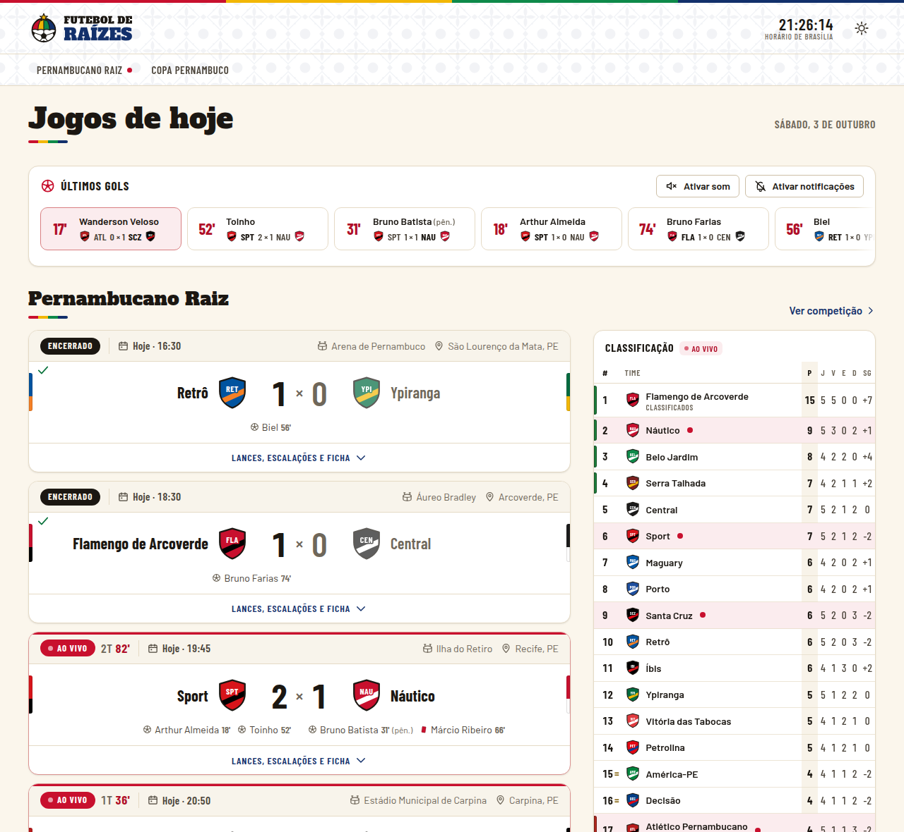
  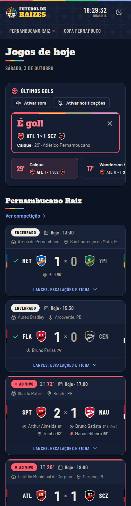
</p>

---

## Sumário

- [Arquitetura](#arquitetura)
- [Como rodar](#como-rodar)
- [Seed, credenciais e simulação](#seed-credenciais-e-simulação)
- [Marca e logo (configuração)](#marca-e-logo-configuração)
- [Fluxo do operador](#fluxo-do-operador)
- [Django Admin: navegação por competição](#django-admin-navegação-por-competição)
- [APIs e documentação interativa](#apis-e-documentação-interativa)
- [Controle de acesso e limites](#controle-de-acesso-e-limites)
- [Métricas, logs e auditoria](#métricas-logs-e-auditoria)
- [Testes](#testes)
- [Do plano à implementação (fases 0 a 12)](#do-plano-à-implementação-fases-0-a-12)
- [Capturas de tela](#capturas-de-tela)

---

## Arquitetura

É um **monólito modular**: um processo ASGI (uvicorn, um worker) e um banco PostgreSQL 16.
O processo serve as páginas, a API de operação, a API de leitura, a API pública, o Django
Admin e o stream SSE. Toda escrita passa pelo mesmo núcleo de domínio.

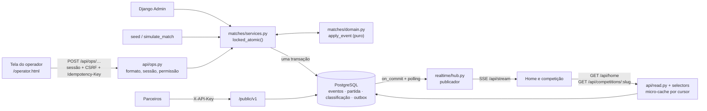

### Módulos

| Pasta | Responsabilidade |
| --- | --- |
| `config/` | settings (tudo por variável de ambiente), urls, asgi; `BRAND` (logo e marca) e `REALTIME` |
| `core/` | trava de escrita (`core.locks.locked_atomic`), datas no horário de Brasília (`core.timeutils`), páginas, `/health`, storage dos estáticos |
| `accounts/` | usuário próprio e os perfis Operador e Administrador (`accounts.roles`) |
| `competitions/` | competição, temporada, fase (pontuação, critérios, zonas), grupo, rodada, time; comando `seed`. Jogador não tem cadastro: o nome vai no lance e na escalação |
| `matches/` | partida, evento imutável, confronto e enriquecimento; `domain.py` (regras puras), `services.py` (escrita), `selectors.py` (leitura e serialização); comando `simulate_match` |
| `standings/` | `domain.compute_standings` (puro), a classificação em cache (oficial e ao vivo) e as punições/bonificações em pontos (`PointAdjustment`) |
| `realtime/` | tabela `outbox`, hub publicador e a view SSE; comando `purge_outbox` |
| `api/` | Django Ninja: `/api/auth`, `/api/ops` e as rotas de leitura, com `/api/docs` |
| `public_api/` | API pública `/public/v1` (fase 12): chave, limite de uso, cache HTTP, OpenAPI; comando `create_api_key` |
| `observability/` | auditoria (`AuditLog`), logs JSON, métricas Prometheus em `/metrics`, id de requisição |
| `templates/`, `static/` | 3 páginas (home, competição, operador), páginas de erro, CSS único, módulos ES, fontes, ícones e som |

Regra de ouro: o **domínio puro não importa Django**. `apply_event`, `visible_events`,
`compute_standings` e `compute_tie_result` são testáveis sem banco; o ORM só carrega e grava.

### Caminho de escrita (gravar antes de publicar)

1. A tela do operador envia `POST /api/ops/matches/{id}/events` com `Idempotency-Key`
   (gerada com `crypto.randomUUID()`) e o token CSRF.
2. A camada HTTP valida sessão, permissão e formato: `401`, `403` ou `400 invalid_input`.
3. `matches.services.post_event` abre a transação e pega a **trava global**
   (`pg_advisory_xact_lock`). Os lançamentos entram em fila e a ordem dos ids do outbox é a
   ordem dos commits.
4. `domain.apply_event` valida as regras (máquina de estados, catálogo de eventos, mata-mata)
   e devolve o novo estado, ou rejeita com `422 <código da regra>`. Regras brandas pedem
   confirmação: `422 confirmation_required`, e o reenvio usa `confirm: true` e a mesma chave.
5. Na mesma transação são gravados o evento (e o vermelho automático do 2º amarelo), o cache
   da partida (placar derivado dos gols válidos, período, relógio, `version`), o resultado do
   confronto, a classificação do grupo (oficial e ao vivo), as mensagens do **outbox**
   (`match`, `standings`, `goals`) e a **auditoria**.
6. Depois do commit, o hub publica as mensagens para todos os navegadores conectados.

Uma chave de idempotência repetida devolve a resposta original, então um clique duplo não
vira dois gols. Nenhum evento é apagado ou editado. Um erro do operador vira lançamento
cancelado (some das leituras e fica na auditoria). Um gol anulado é fato do jogo: fica na
linha do tempo, riscado, com o motivo. O Django Admin, o `seed` e o `simulate_match` passam
pelos mesmos serviços.

### Outbox e hub SSE

- **Outbox**: a mensagem é gravada na mesma transação da escrita, então nada se perde se o
  processo cair entre gravar e publicar. As mensagens ficam 24 h (`OUTBOX_RETENTION_HOURS`)
  para reenvio na reconexão.
- **Hub** (`realtime/hub.py`): um por processo. Acorda no `on_commit` de cada escrita e faz
  um polling de segurança (`REALTIME_POLL_INTERVAL`) para pegar escritas de outros processos,
  como scripts. Lê o outbox uma vez por lote e entrega o mesmo quadro, já serializado, a
  todas as conexões. Quem acumula mais de `REALTIME_QUEUE_SIZE` lotes é desconectado e volta
  com `Last-Event-ID`.
- **Stream** `GET /api/stream?after=N`: um por página, com todas as competições. A retomada
  usa `Last-Event-ID` (reconexão automática do `EventSource`) ou `after` (o `cursor` da
  leitura). Um `ping` com a hora do servidor sai a cada 20 s e acerta o relógio da página.
- Cada mensagem traz o **estado completo** (partida, classificação ao vivo da fase ou lista de
  últimos gols), e o front só substitui o trecho, sem merge.

### Modelo de leitura

- Placar e classificação são **projeções dos eventos**. As colunas de placar da partida e a
  tabela `standings` (`kind` oficial e ao vivo) são caches gravados na mesma transação e
  sempre recalculados por inteiro, nunca incrementados.
- As leituras devolvem `cursor`, o maior id do outbox, lido **antes** do estado. A página
  assina o stream a partir dele e nenhuma mensagem se perde entre a resposta e o stream.
- `GET /api/home` e `GET /api/competitions/{slug}` têm um **micro-cache** em memória
  (`READ_CACHE_SECONDS`, 5 s) chaveado pelo cursor. Toda escrita que publica muda o cursor e
  invalida a entrada na hora. Um acerto custa uma consulta.
- Uma lista de partidas usa uma consulta só para os eventos de todas. Os estáticos têm hash
  no nome e cache imutável, saem pré-comprimidos (`.br`/`.gz`) pelo WhiteNoise e passam por
  `modulepreload`.
- O “dia”, o relógio e os horários seguem o horário de Brasília (`APP_TIME_ZONE`). A home
  inclui o jogo da véspera que passa da meia-noite até 2 h depois do fim.

### Front-end

São três páginas servidas pelo próprio Django: `/` (home), `/competition.html?slug=` e
`/operator.html`. Os templates só injetam a marca; os dados vêm da API. Os módulos ES ficam em
`static/js/` (`api.js`, `stream.js`, `clock.js`, `alerts.js`, `match-card.js`,
`standings.js`, …), com uma folha `static/css/app.css` organizada em `@layer`.

- **Tema claro por padrão**, com seletor para o escuro (“noite de maracatu”) no cabeçalho.
  A escolha é aplicada antes da 1ª pintura, fica guardada no navegador, sincroniza entre abas
  e também vale no Django Admin.
- **Identidade**: faixa do frevo (vermelho, amarelo, verde e azul) em todas as páginas;
  Alfa Slab One (cordel) nos títulos; Barlow Condensed nos números; azulejo em máscara;
  estado vazio do sertão; microtexto com sotaque (“É gol!”, “Oxe! Gol anulado.”, “Hoje não
  tem jogo, visse?”).
- **Componente de jogo**: inspirado no wireframe, sem copiá-lo. Tem faixa de meta com status
  em texto e cor, minuto ao vivo e estádio; placar central com escudos e faixas nas cores dos
  times; autores dos gols e vermelhos visíveis sem abrir; agregado e quem avança no
  mata-mata. O acordeão traz as abas Lances (linha do tempo de dois lados), Escalações e
  Ficha.
- Alertas de gol só com a home aberta: aviso `aria-live`, som (depois de “Ativar som”) e
  notificação do sistema (computador, HTTPS, depois de “Ativar notificações”).

---

## Como rodar

Requisitos: Python 3.11+, PostgreSQL 16, Node 18+ (só para os testes JS). Para o ambiente
completo com HTTPS: Docker com Compose v2.

### Docker Compose (ambiente de teste com HTTPS)

O Compose sobe PostgreSQL 16, **um** processo ASGI (`uvicorn --workers 1`, porque o hub vive
nele) e o **Caddy** como proxy com HTTPS da CA interna, HTTP/2 e HTTP/3 e o stream SSE sem
buffer (`deploy/Caddyfile`). É o ambiente da fase 6 do plano.

```bash
cp .env.example .env
# troque DJANGO_SECRET_KEY no .env por uma chave nova:
python -c 'import secrets; print(secrets.token_urlsafe(50))'

docker compose up --build -d
docker compose exec app python manage.py seed           # dados de demonstração (opcional)
docker compose exec app python manage.py createsuperuser # ou use o admin do seed
# abra https://localhost (certificado da CA interna do Caddy)
```

- `DJANGO_SECRET_KEY` é obrigatória: sem ela todo comando do Compose para com erro. Com
  `DJANGO_DEBUG=0` (forçado no Compose e na imagem), o app se recusa a subir com a chave do
  exemplo ou com qualquer chave fraca.
- O app roda migrado, com `DEBUG=0`, cookies seguros e pool de conexões (`DB_POOL=1`), e
  escreve os logs em JSON, uma linha por registro. O healthcheck usa `GET /health`.
- Para o navegador confiar no certificado, importe
  `/data/caddy/pki/authorities/local/root.crt` do volume `caddy_data`.
- Para trocar o endereço, use `SITE_ADDRESS` e inclua o host em `DJANGO_ALLOWED_HOSTS` e
  `https://<host>` em `DJANGO_CSRF_TRUSTED_ORIGINS`. As portas ficam em `HTTP_PORT` e
  `HTTPS_PORT`.
- Para conferir a configuração sem subir nada: `docker compose config -q` (precisa da chave
  no `.env` ou no shell).
- **Produção num VPS** (certificado do Let's Encrypt com `CADDY_TLS=<e-mail>`, levar os
  dados do PC, backup diário com `scripts/backup.sh` e `scripts/restore.sh`): veja
  [`docs/DEPLOY.md`](docs/DEPLOY.md).

### Desenvolvimento local (PostgreSQL + `scripts/run_dev.sh`)

```bash
python -m venv .venv && . .venv/bin/activate
pip install -r requirements-dev.txt
cp .env.example .env                      # ajuste DB_* para o seu PostgreSQL

# o .env só é lido pelo run_dev.sh; para os comandos do manage.py, exporte-o no shell:
set -a; . ./.env; set +a

psql -h localhost -U postgres -c "create database fdr"   # o nome de DB_NAME
python manage.py migrate
python manage.py seed
scripts/run_dev.sh                        # http://127.0.0.1:8000 (HOST=… PORT=… para mudar)
```

- `scripts/run_dev.sh` carrega o `.env`, roda `migrate` e sobe **um** processo uvicorn com
  recarga automática. As conexões SSE abertas são encerradas em 2 s na recarga e o navegador
  reconecta sozinho.
- Sem PostgreSQL local, `scripts/dev_db.sh` sobe só o banco do Compose, publicado em
  `127.0.0.1:${DB_PUBLISH_PORT:-5432}` (`deploy/compose.dev.yml`). Para parar:
  `scripts/dev_db.sh stop`.
- Com `DJANGO_DEBUG=1` o guia de estilo fica em `/styleguide.html`, com todos os componentes
  e estados sobre dados de exemplo.

| Endereço | O que é |
| --- | --- |
| `/` | Home: jogos de hoje, últimos gols, classificação ao vivo |
| `/competition.html?slug=pernambucano-raiz` | Página da competição (rodadas, fases, classificação, confrontos) |
| `/operator.html` | Tela do operador |
| `/admin/` | Django Admin (competições → temporadas → fases → rodadas → jogos; times; usuários, chaves, auditoria) |
| `/public/v1/docs` | Documentação da API pública (só leitura; o link "API" do rodapé) |
| `/api/docs` | Documentação da API interna, só para a conta de administrador (link no índice do admin; para os outros, 404) |
| `/health` · `/metrics` | Healthcheck e métricas Prometheus |

### Variáveis de ambiente

Todas estão comentadas em [`.env.example`](.env.example). As principais:

| Grupo | Variáveis |
| --- | --- |
| Django | `DJANGO_SECRET_KEY`, `DJANGO_DEBUG`, `DJANGO_ALLOWED_HOSTS`, `DJANGO_CSRF_TRUSTED_ORIGINS`, `SECURE_COOKIES`, `SECURE_HSTS_SECONDS`, `SECURE_SSL_REDIRECT`, `APP_TIME_ZONE`, `STATICFILES_BACKEND` |
| Banco | `DB_NAME`, `DB_USER`, `DB_PASSWORD`, `DB_HOST`, `DB_PORT`, `TEST_DB_NAME`, `DB_POOL`, `DB_POOL_MIN`, `DB_POOL_MAX`, `DB_PUBLISH_PORT` |
| Marca | `BRAND_NAME`, `BRAND_SHORT_NAME`, `BRAND_TAGLINE`, `BRAND_LOGO_URL`, `BRAND_LOGO_DARK_URL`, `BRAND_LOGO_ALT`, `BRAND_FAVICON_URL`, `BRAND_THEME_COLOR` |
| Tempo real | `REALTIME_PING_INTERVAL`, `REALTIME_POLL_INTERVAL`, `OUTBOX_RETENTION_HOURS`, `REALTIME_QUEUE_SIZE`, `REALTIME_HUB_ENABLED` |
| Leitura | `READ_CACHE_SECONDS` |
| Observabilidade | `METRICS_TOKEN`, `LOG_LEVEL`, `LOG_FORMAT` (`json` ou `plain`) |
| API pública | `PUBLIC_API_RATE_LIMIT`, `PUBLIC_API_CACHE_MAX_AGE` |
| Só Compose | `SITE_ADDRESS`, `HTTP_PORT`, `HTTPS_PORT` |
| Só seed | `SEED_ADMIN_PASSWORD`, `SEED_OPERATOR_PASSWORD` |

---

## Seed, credenciais e simulação

```bash
python manage.py seed                    # dados do dia de hoje (Brasília)
python manage.py seed --reset            # apaga o que o seed criou e recria (mantém os usuários)
python manage.py seed --clear            # só apaga o que o seed criou, sem recriar (mantém os usuários)
python manage.py seed --date 2026-10-03  # outro dia
```

**Apagar os dados de teste.** `seed --clear` apaga as duas competições do seed com tudo o que
há dentro delas (temporadas, fases, grupos, rodadas, partidas, lances, confrontos, escalações,
punições e a classificação), os times do seed que não são usados fora dele e as mensagens do
outbox dessas partidas e fases (com a trava de escrita, sem cruzar com um lançamento). Usuários,
auditoria e o que foi cadastrado à mão ficam. Para zerar **o banco inteiro** (tudo, usuários
inclusive) e recomeçar:

```bash
dropdb -h localhost -U postgres fdr && createdb -h localhost -U postgres fdr   # o nome de DB_NAME
python manage.py migrate
python manage.py seed            # opcional: dados de demonstração de novo
python manage.py createsuperuser # ou use os usuários do seed
```

No Compose, o equivalente é `docker compose down -v` (apaga o volume do banco) e
`docker compose up -d`.

**Cadastrar times em lote.** `import_teams` lê um JSON: uma lista de objetos, um por time, com
`nome` e `sigla` (obrigatórias; sigla até 4 letras, vira maiúscula), `cidade`, `cor_principal`,
`cor_secundaria` (#RRGGBB) e `escudo_url`. As chaves em inglês (`name`, `short_name`, `city`,
`color_primary`, `color_secondary`, `crest_url`) também valem.

```json
[
  {"nome": "Sport", "sigla": "SPT", "cidade": "Recife", "cor_principal": "#D71920",
   "cor_secundaria": "#000000", "escudo_url": "https://exemplo.com/sport.png"},
  {"nome": "Náutico", "sigla": "NAU", "cidade": "Recife", "cor_principal": "#C8102E"},
  {"nome": "Retrô", "sigla": "RET"}
]
```

```bash
python manage.py import_teams times.json --dry-run  # mostra o que faria, sem gravar
python manage.py import_teams times.json            # cria; quem já existe (pelo nome) é pulado
python manage.py import_teams times.json --update   # cria e atualiza os que já existem
```

É tudo ou nada: com qualquer item inválido (sigla longa, cor fora do formato, nome repetido),
nada é gravado e o comando aponta o item e o motivo. Um CSV com as mesmas colunas no cabeçalho
(vírgula ou ponto e vírgula) também é aceito. O escudo em arquivo é enviado pelo admin.

**Tabela de jogos em JSON (pontos corridos e grupos).** Na página da fase no admin (ao criar ou editar),
a seção "Tabela de jogos (JSON)" recebe os participantes e as rodadas com os jogos da fase:

```json
{"times": ["SPT", "NAU", "SCZ", "RET"],
 "rodadas": [
  {"numero": 1, "nome": "1ª rodada", "jogos": [
    {"mandante": "SPT", "visitante": "NAU", "data": "2027-01-15 19:00", "local": "Ilha do Retiro", "cidade": "Recife"},
    {"mandante": "Santa Cruz", "visitante": {"id": 42}, "data": "2027-01-16 16:00"}
  ]}
]}
```

Na fase de grupos, os participantes vão em `"grupos": {"A": ["SPT", "NAU"], "B": ["SCZ", "RET"]}`
(grupo novo é criado). `times`/`grupos` só precisam listar quem ainda não está na fase. O time vai
pela sigla, pelo nome ou por `{"id": N}`; a sigla é procurada primeiro entre os times da fase e,
se for de mais de um time, o import recusa e lista os candidatos. `data` é o horário de Brasília;
`local` e `cidade` são opcionais.

São recusados: time que não está no campeonato (nem na fase nem em `times`/`grupos`), time em
dois jogos da mesma rodada e time em dois grupos. Times de grupos diferentes podem se enfrentar
(como na Copa do Nordeste): o jogo fica no grupo do mandante e conta na classificação dos dois. Rodada que já existe (pelo número)
recebe os jogos e jogo repetido (mesmos mandante e visitante na rodada) é pulado. Com qualquer
erro, nada é gravado e o campo mostra onde e por quê. Mata-mata ainda não é aceito.

**Classificação geral e personalizadas.** Na página da temporada no admin, "Classificações gerais
e personalizadas" cria tabelas além das de cada fase:

* **Geral do torneio** — soma todos os jogos (mata-mata inclusive) das fases marcadas, com todos os
  times delas. Marque só as fases que contam: "a partir da 2ª fase" = desmarcar a 1ª.
* **Personalizada** — os mesmos jogos, mas só os times escolhidos aparecem (ex.: vaga na Série D
  entre os 7 dos 10 que não têm divisão nacional; jogo contra quem está fora conta para quem está).

* **Posição nos grupos** — marque uma fase de grupos e uma posição (N): compara quem está, naquele
  momento, na N-ª posição de cada grupo (ex.: melhores terceiros, melhores quartos). É a geral da
  fase filtrada para esses times; o confronto direto só considera jogos entre eles. Com grupos de
  tamanhos diferentes, a opção "desconsiderar jogos contra os últimos dos grupos maiores" tira, nos
  grupos maiores, os jogos contra quem passa do tamanho do menor grupo.

Cada uma tem pontuação, critérios de desempate e zonas próprios, e as punições das fases marcadas
somam.

**Zona condicional.** Na fase, uma zona pode apontar para uma classificação e uma faixa dela: ex.
"3º colocado: verde só se estiver do 1º ao 4º em 'Melhores terceiros'". Quem está na posição mas
fora da faixa fica sem a cor; a legenda explica a condição, e tudo se atualiza ao vivo. Onde aparece: "mostrar na página da competição" (botão ao lado da classificação, em qualquer
fase) e/ou "mostrar na página destas fases" (botão só quando a página mostra essas fases). A tabela
é calculada na hora (`GET /api/rankings/{id}`) e se atualiza ao vivo.

Na fase de grupos, cada grupo soma os jogos dos seus times contra qualquer adversário da fase:
jogo entre grupos diferentes conta para os dois.

**Temporada que cruza o ano.** A temporada tem "ano" (início) e "ano final" (opcional): vazio, é
de ano único (2026); preenchido, cruza o ano, como as europeias (2026/2027). As páginas e as APIs
mostram o rótulo (`season.label`).

O seed lança tudo pelos serviços de escrita, com origem `script` e horários reais:

- **Pernambucano Raiz**: pontos corridos com as regras do primeiro campeonato (3/1/0;
  pontos, vitórias, saldo, gols pró, confronto direto; Classificados 1–4, Rebaixados 17–20),
  20 clubes e turno único. As 4 primeiras rodadas estão encerradas; a 5ª é no dia, com dois
  jogos encerrados, dois **ao vivo** (um no 2º tempo, com gol anulado pelo VAR e 2º amarelo)
  e o resto mais tarde.
- **Copa Pernambuco**: grupos A e B encerrados, semifinais de ida e volta com prorrogação e
  a final no dia, em jogo único sem prorrogação.
- Também inclui escalações, arbitragem, transmissões, estatísticas, público e renda. Os
  jogadores são só nomes (gerados em memória para cada time e gravados nas escalações e nos
  lances): não existe cadastro de jogadores.

| Perfil | Usuário | Senha padrão | Variável para trocar |
| --- | --- | --- | --- |
| Administrador | `admin` | `raizes-admin-2026` | `SEED_ADMIN_PASSWORD` |
| Operador | `operador` | `raizes-operador-2026` | `SEED_OPERATOR_PASSWORD` |

> Essas senhas são só para demonstração. Em qualquer ambiente exposto, defina as variáveis
> antes do seed ou troque as senhas no admin.

O seed termina mostrando os jogos ao vivo e o comando para continuá-los. O `simulate_match`
leva uma partida do estado atual até o fim, lance a lance: gols, cartões, substituições,
acréscimos, VAR e, no mata-mata, prorrogação e pênaltis quando cabem. Ele usa os mesmos
serviços, então as páginas abertas acompanham pelo stream.

```bash
python manage.py simulate_match 43                       # ~4 min por jogo (30 min de jogo por minuto real)
python manage.py simulate_match 43 --speed 1             # tempo real
python manage.py simulate_match 44 --until-minute 70 --seed 7   # para no minuto 70, sorteio repetível
```

---

## Marca e logo (configuração)

A marca é configurada por variáveis de ambiente, sem mexer no código. `config/settings.py`
monta `BRAND`, e o context processor `brand` a leva a todas as páginas, às páginas de erro e
ao Django Admin.

| Variável | Padrão | Uso |
| --- | --- | --- |
| `BRAND_NAME` | `Futebol de Raízes` | Nome nos títulos, no rodapé e no admin (`<nome> · Administração`); também é o `alt` do logo |
| `BRAND_SHORT_NAME` | `Raízes` | Nome curto |
| `BRAND_TAGLINE` | `O futebol pernambucano, lance a lance` | Slogan (rodapé, descrição) |
| `BRAND_LOGO_URL` | `img/logo.svg` | Logo do tema claro: caminho dentro de `static/` ou URL absoluta (`https://…`) |
| `BRAND_LOGO_DARK_URL` | vazio | Logo do tema escuro; vazio usa `img/logo-dark.svg` com o logo padrão, ou o mesmo arquivo com logo próprio |
| `BRAND_LOGO_ALT` | `BRAND_NAME` | Texto alternativo do logo |
| `BRAND_FAVICON_URL` | `img/favicon.svg` | Favicon e símbolo do rodapé e do login |
| `BRAND_THEME_COLOR` | `#12306B` | `theme-color` da barra do navegador no celular |

O logo pode ter qualquer proporção: a altura é fixa e a largura vai até 240 px, sem
distorcer, e um logo 10:1 não empurra o relógio nem o seletor de tema para fora da tela.
Um arquivo novo em `static/img/` exige `collectstatic`, ou seja, um novo build da imagem
Docker. Uma URL absoluta não exige nada disso.

O logo padrão é uma bola cuja metade de cima é a sombrinha do frevo, com a estrela da
bandeira de Pernambuco e o wordmark “FUTEBOL DE RAÍZES”. Os arquivos são `static/img/logo.svg`,
`logo-dark.svg`, `logo-mark.svg` e `favicon.svg`.

---

## Fluxo do operador

1. Entre em `/operator.html` com um usuário dos perfis **Operador** ou **Administrador**.
   Entrar num perfil já marca `is_staff`, o que abre o admin.
2. Escolha a partida da data. As partidas vêm agrupadas por competição, e ↑/↓ andam pela
   lista; a URL guarda `?date=&match=`.
3. O painel mostra o placar, os **lances** disponíveis (gol, pênaltis, cartões,
   substituição, VAR, acréscimos, gol anulado) e, à parte, o **Andamento do jogo** (início,
   fim do 1º tempo, 2º tempo, prorrogação, pênaltis, fim). Tudo vem de `available` na
   resposta do back, sem regra de jogo no front. Toda mudança de período pede confirmação
   com o placar.
4. O formulário segue o catálogo: time, jogador (nome digitado, com a escalação em
   `<datalist>`), origem do gol e minuto sugerido pelo relógio do jogo. Avisos brandos (minuto menor que o anterior,
   jogador fora de campo) abrem a confirmação e reenviam com a mesma chave.
5. Na linha do tempo, **Cancelar lançamento** corrige erro de digitação (com motivo
   opcional). **Status da partida** adia, suspende, retoma, reagenda (data e hora de
   Brasília) ou cancela.
6. A tela só mostra o que `GET /api/auth/me` permite. Cadastros e regras da classificação
   (competições, fases, critérios, zonas e cores, punições em pontos, grupos, rodadas, times,
   partidas, confrontos, escalações, arbitragem, estatísticas) ficam no **Django Admin** (seção
   seguinte). Usuários, perfis, chaves da API pública e auditoria são exclusivos do
   Administrador. Os perfis Operador e Administrador são recriados a cada `migrate` e aparecem
   somente leitura no admin.

---

## Django Admin: navegação por competição

O índice do admin mostra só os pontos de entrada: **Competições** e **Times** (e, para o
Administrador, usuários, perfis, chaves da API pública e auditoria). O resto se abre descendo a
hierarquia, e cada página mostra a trilha **Início › Competição › Temporada › Fase › Rodada ›
Jogo**. "Salvar" volta para o nível de cima. As listas globais de partidas, rodadas, grupos e
confrontos saíram do índice (os endereços continuam, para quem tem permissão).

| Página | O que tem |
| --- | --- |
| Competição | Dados, temporadas e um painel com as fases de cada temporada (links e "+ adicionar fase") |
| Temporada | Fases (nome, ordem, formato) com o link "abrir" |
| Fase | Pontuação, critérios de desempate, zonas da legenda, **punições e bonificações em pontos**, grupos (com "Times do grupo (N)") e rodadas (com "Jogos da rodada (N)"; no mata-mata, "Confrontos e jogos"). Um quadro explica de onde vem a classificação |
| Rodada | Os jogos da rodada (mandante, visitante, início, estádio, cidade; grupo só entre os da fase; status e placar somente leitura; "abrir") e, no mata-mata, os confrontos (jogos, prorrogação, times) — o jogo escolhe o confronto só entre os da rodada |
| Jogo | Estrutura, situação e placar (calculados), **lances** (somente leitura, com "Cancelar lançamento" por linha), arbitragem, transmissões, estatísticas e os links das escalações. O botão **Lançar lances na tela do operador** abre `/operator.html?match=<id>` |
| Escalação | Esquema, técnico e os jogadores (só nome, número e posição) |

- **Lances**: são lançados na tela do operador, que confere os campos de cada tipo. Na página do
  jogo, um lance errado se corrige marcando "Cancelar lançamento" e salvando; o admin chama
  `matches.services.void_event` (perfil com a permissão de cancelar), mostra o erro da regra
  quando o cancelamento não pode, e nada é apagado. Os cancelados somem da lista.
- **Classificação**: não tem página. É um cache que o sistema recalcula a cada lance a partir
  dos jogos, da pontuação, dos critérios e das punições. A **oficial** conta só os jogos
  encerrados; a **ao vivo** inclui os jogos em andamento e é a que as páginas públicas mostram.
- **Punição (time que perdeu pontos)**: na página da fase, em "punições e bonificações", escolha o
  time (só os dos grupos da fase), os pontos (negativo tira, positivo dá; zero não vale) e o
  motivo. Ao salvar, as tabelas da fase são recalculadas e a classificação nova é publicada no
  stream. Os pontos ajustados valem para o critério "Pontos" e para a ordem; o confronto direto
  continua só com os resultados dos jogos. Nas páginas públicas, os pontos ganham uma marca
  ("13\*") e a lista "Santa Cruz: −3 pts — escalação irregular" aparece embaixo da legenda; a API
  traz `points_adjustment` em cada linha e `adjustments` na fase.
- Tudo segue o perfil (accounts/roles.py) e toda gravação passa pelos mesmos serviços e pela
  trava de escrita; cada ação do admin vai para a auditoria.

<p align="center">
  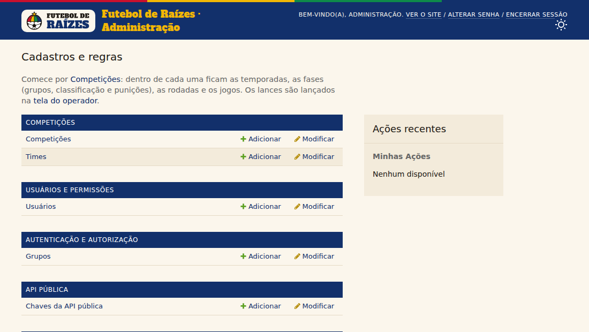
  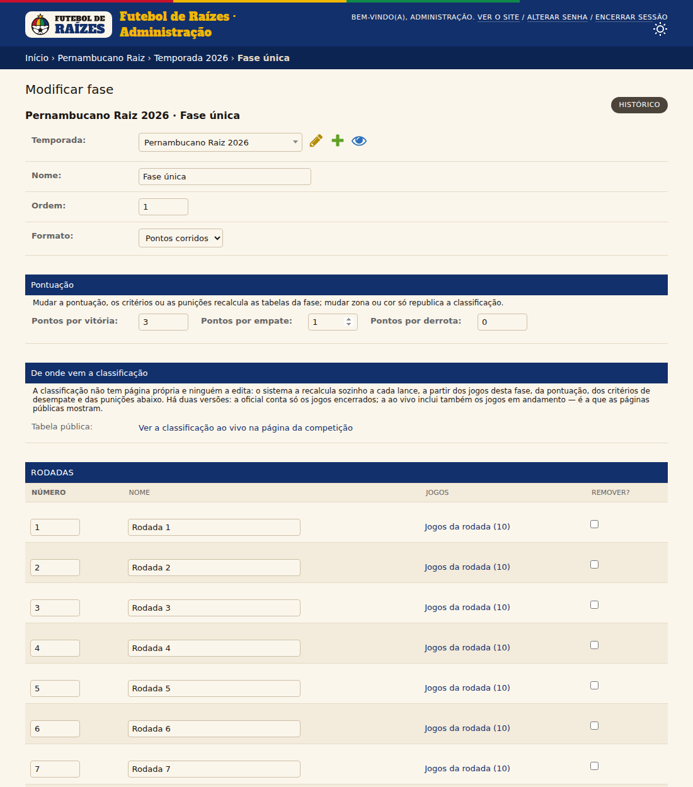
</p>
<p align="center">
  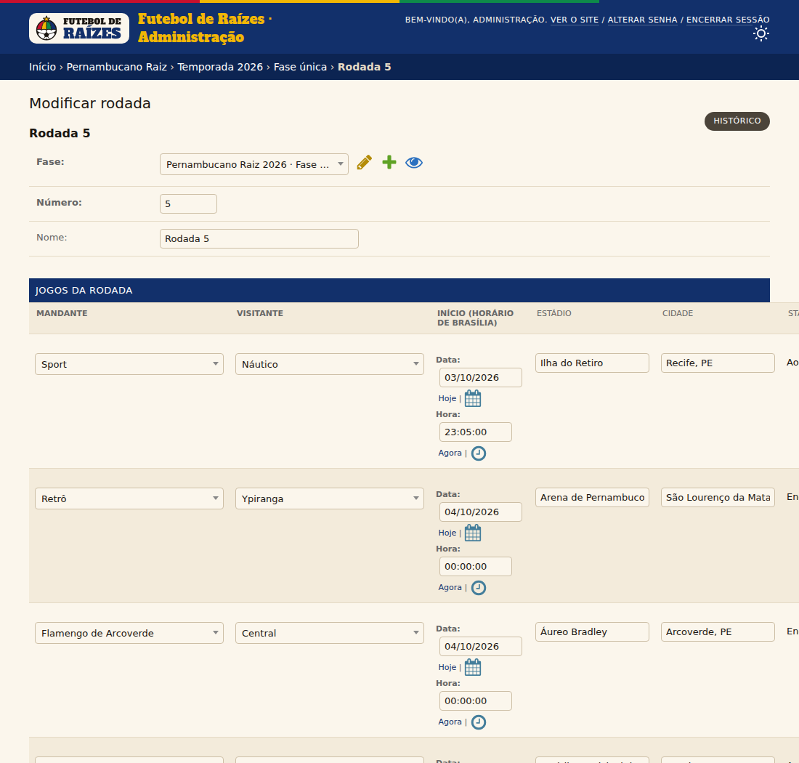
  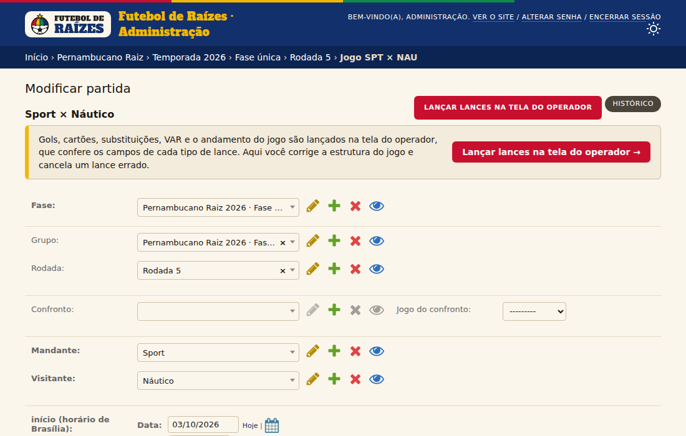
</p>

---

## APIs e documentação interativa

| Porta | Rotas | Documentação |
| --- | --- | --- |
| Autenticação | `POST /api/auth/login`, `POST /api/auth/logout`, `GET /api/auth/me` | `/api/docs` |
| Operação | `POST /api/ops/matches/{id}/events` (+ `Idempotency-Key`), `POST …/events/{eventId}/void`, `POST /api/ops/matches/{id}/status`, `GET /api/ops/catalog` | `/api/docs` |
| Leitura | `GET /api/home?date=`, `GET /api/competitions`, `GET /api/competitions/{slug}?stage=&round=`, `GET /api/stages/{id}/standings?live=1`, `GET /api/matches?roundId=&date=&status=&stageId=`, `GET /api/matches/{id}` | `/api/docs` |
| Tempo real | `GET /api/stream?after=` (SSE) | `docs/CONTRACT.md` §5 |
| Pública | `GET /public/v1/competitions`, `/competitions/{slug}`, `/matches`, `/matches/{id}`, `/stages/{id}/standings` | `/public/v1/docs` |

- **`/api/docs`** (Swagger do Django Ninja): só para a conta de administrador (superusuário
  ou perfil Administrador), pelo link "API interna" do índice do admin. Para qualquer outro,
  inclusive sem login, `/api/docs` e `/api/openapi.json` respondem 404. O “Try it out” já envia o token CSRF. Faça login
  por `POST /api/auth/login` e recarregue a página. Sem login as rotas de operação respondem
  `401`, e sem permissão `403`. Uma regra violada responde `422` com o código da regra.
- **API pública** (`/public/v1`, fase 12): só leitura, com serializadores de lista de
  permissão. Gol anulado, eventos de status e lançamentos cancelados nunca aparecem. Exige
  `X-API-Key` e tem limite por chave (cabeçalhos `X-RateLimit-*` e `429` com `Retry-After`),
  `ETag`/`304` e `Cache-Control: public`. A documentação e o `openapi.json` abrem sem chave.

```bash
python manage.py create_api_key "Rádio Capibaribe" --limit 120   # a última linha é a chave
curl -H "X-API-Key: fdr_…" "http://127.0.0.1:8000/public/v1/matches?date=2026-10-03"
```

O Administrador também cria chaves no admin (o texto aparece uma vez) e pode desativá-las.
Só o hash fica no banco.

---

## Controle de acesso e limites

| Porta | Quem acessa | Proteção |
| --- | --- | --- |
| Leitura (`/api/home`, `/api/competitions`, `/api/matches`, `/api/stream`) | qualquer visitante | só dados publicados; limite por IP |
| Operação (`/api/ops/*`) | usuário logado com permissão | sessão + CSRF; 401 sem login, 403 sem a permissão da ação (lançar, cancelar, mudar status) |
| Django Admin | perfis Operador e Administrador | o perfil decide o que aparece; usuários, grupos, chaves e auditoria só para o Administrador |
| API pública (`/public/v1`) | quem tem chave | `X-API-Key` (só o hash é guardado) e limite por chave |

Contra força bruta e enxurrada:

- **Login** (API e `/admin/login/`): bloqueio progressivo por usuário + IP — 5 falhas
  seguidas bloqueiam por 1 min, dobrando a cada novo bloqueio até 15 min — e por IP
  (20 falhas em 15 min, com qualquer usuário, bloqueiam o IP por 15 min). Bloqueado,
  a senha nem é conferida; a API responde `429 login_locked` com `Retry-After` e o admin
  mostra o aviso. Não há bloqueio só por usuário, para um atacante não trancar fora o
  operador de verdade. Toda tentativa vai para a auditoria (`accounts/throttle.py`).
- **Requisições por IP** nas rotas `/api/`: 240 por minuto; passou, `429 rate_limited`
  com `Retry-After`, antes de chegar à view ou ao banco (`core/ratelimit.py`).
- **Stream**: até 20 conexões abertas por IP (`429 too_many_streams`) e 5000 no processo
  (`503 stream_capacity`); o front espera com recuo exponencial antes de tentar de novo.
- **Corpo da requisição**: até 1 MB (Django e Caddy).
- **IP confiável**: os limites usam só `REMOTE_ADDR`. Atrás do Caddy, o uvicorn
  (`--proxy-headers`) o preenche com o IP real; o Caddy não repassa `X-Forwarded-For`
  vindo de fora, então o cliente não consegue trocar de IP pelo header.

Todos os números são configuráveis no `.env` (`LOGIN_THROTTLE_*`,
`API_RATE_LIMIT_PER_MINUTE`, `REALTIME_MAX_STREAMS*`). Os contadores ficam na memória do
processo — certo com um processo ASGI só; com mais processos, troque o cache `default`
por Redis ou Memcached. Métricas: `fdr_login_lockouts_total`, `fdr_rate_limited_total`.

## Métricas, logs e auditoria

- **Métricas** em `GET /metrics`, no formato texto do Prometheus. O acesso é por
  `Authorization: Bearer $METRICS_TOKEN` ou por usuário logado com
  `observability.view_metrics` (o Administrador). Séries principais:
  - `fdr_http_requests_total` e `fdr_http_request_duration_seconds`, por rota;
  - `fdr_events_posted_total`, `fdr_events_voided_total`, `fdr_status_changes_total` e
    `fdr_domain_rejections_total`;
  - `fdr_outbox_messages_total`, `fdr_stream_messages_published_total`, `fdr_sse_connections`
    e `fdr_outbox_lag_seconds`;
  - `fdr_public_api_requests_total`, `fdr_public_api_throttled_total` e
    `fdr_audit_records_total`.
- **Logs** em JSON, uma linha por registro (`LOG_FORMAT=json`), incluindo os do uvicorn. Sai
  uma linha `fdr.http` por requisição, com rota, status, duração e `request_id`. O
  `X-Request-ID` recebido só é aceito se tiver de 1 a 64 caracteres de `[A-Za-z0-9._:-]`;
  senão o servidor gera um. O id volta na resposta e vai para os logs e a auditoria.
- **Auditoria** em Admin → Operação e auditoria → Auditoria, somente leitura, só para o
  Administrador. Cada ação de operador fica gravada na mesma transação, com autor, horário,
  IP e id da requisição:
  - partida: `event.create`, `event.void`, `match.status` e `match.edit`;
  - admin: `admin.add`, `admin.change` e `admin.delete`;
  - acesso, em qualquer porta: `auth.login`, `auth.logout`, `auth.login_failed` (só o usuário
    digitado, nunca a senha) e `auth.password_change`;
  - chaves: `api_key.create`.
- `python manage.py purge_outbox [--hours N]` apaga mensagens antigas do outbox; o hub já
  faz isso a cada hora.

---

## Testes

```bash
# pytest + pytest-django; use um banco de teste próprio (--create-db na 1ª vez)
TEST_DB_NAME=test_fdr_seu_nome python -m pytest -q --create-db

# módulos JS puros (node:test, sem dependências)
node --test tests/js/*.test.mjs

# ponta a ponta no navegador: banco recriado com o seed, uvicorn de verdade e Chromium
pip install playwright && playwright install chromium   # se ainda não tiver
E2E=1 python -m pytest tests/e2e -o addopts="" -q
```

- **Unidade e integração** (`tests/`): domínio da partida, do mata-mata e da classificação
  sem banco (inclusive tabelas reais de Copas e Euros com confronto direto e fair play);
  serviços (idempotência, trava, outbox, auditoria); rotas `401`/`403`/`422`; virada do dia
  em Brasília; stream SSE com retomada sem perda nem duplicação; restrições do banco; admin;
  navegação do admin por competição, cancelamento pela página do jogo e punições em pontos
  (`tests/test_admin_navigation.py`); seed (`--reset` e `--clear`); API pública (contrato sem
  gol anulado nem tipos internos); deploy (Compose, imagem,
  logs JSON, guarda da chave secreta). Com o Chromium do Playwright instalado, também rodam os
  testes das páginas com a API simulada.
- **E2E** (`tests/e2e`, só com `E2E=1`): o operador lança um jogo inteiro pela tela; home e
  competição, abertas antes, acompanham gol e anulação sem recarregar (aviso, som,
  notificação); a final vai aos pênaltis; uma punição salva no admin aparece na classificação
  aberta; o stream volta sozinho depois de reiniciar o servidor. Também confere tema, marca, 390 px sem rolagem lateral, CLS < 0,1 e console limpo.
  Variáveis opcionais: `E2E_DB_NAME`, `E2E_BASE_URL`, `E2E_CHROMIUM`.
- Na última execução: **557 testes passaram** (23 pulados: os de navegador, sem `E2E=1`),
  **52 testes JS** e **23 testes E2E**.

---

## Do plano à implementação (fases 0 a 12)

| Fase | Entrega do plano | Onde está | “Pronto quando” coberto por |
| --- | --- | --- | --- |
| 0. Fundação | Django, Postgres via Compose, usuário próprio, migrações, pytest, `/health` | `config/`, `accounts/models.py`, `docker-compose.yml`, `core/views.health` | `tests/test_foundation.py` |
| 1. Usuários e permissões | Login por sessão, perfis Operador/Administrador, permissões por ação, admin | `accounts/roles.py`, `accounts/admin.py`, `api/auth.py`, `api/security.py` | `tests/test_api_auth.py`, `tests/test_admin.py` |
| 2. Estrutura e partidas | Competição → partida no admin, seed com 2 competições, rotas de leitura com hora e fuso | `competitions/`, `matches/models.py`, `matches/selectors.py`, `api/read.py`, comando `seed` | `tests/test_home_day.py` (virada do dia com jogo após a meia-noite), `tests/test_api_read.py`, `tests/test_seed.py` |
| 3. Eventos e estado | Catálogo, máquina de estados, `apply_event`, placar derivado, idempotência, trava, gol anulado, cancelamento, status | `matches/domain.py`, `matches/services.py`, `core/locks.py`, `api/ops.py` | `tests/test_match_domain.py`, `tests/test_services.py`, `tests/test_api_ops.py` |
| 4. Classificação | `compute_standings`, critérios e zonas configuráveis, confronto direto, oficial e ao vivo | `standings/domain.py`, `standings/services.py`, `competitions/admin.py` | `tests/test_standings_domain.py` (tabelas reais), `tests/test_standings_services.py` |
| 5. Mata-mata | Confrontos de 1 ou 2 jogos, agregado, prorrogação por confronto, pênaltis, `compute_tie_result` | `matches/domain.py`, `matches/models.Tie` | `tests/test_tie_domain.py`, `tests/test_api_knockout.py` |
| 6. Tempo real | Outbox, publicador, `cursor`, SSE com retomada, mensagens `goals`, `ping`; HTTPS, proxy sem buffer, um processo | `realtime/`, `deploy/Caddyfile`, `docker-compose.yml` | `tests/test_realtime.py` (dois clientes, reconexão sem perda nem duplicação) |
| 7. Tela do operador | Login, lançamentos, status, cancelamento | `templates/operator.html`, `static/js/operator.js` | `tests/e2e` (jogo inteiro pela tela), `tests/js/operator.test.mjs` |
| 8. Home e competição | Menu, relógio, últimos gols, jogos com classificação, alertas, rodadas, mata-mata, stream | `templates/index.html`, `templates/competition.html`, `static/js/home.js`, `competition.js`, `alerts.js`, `stream.js` | `tests/e2e`, `tests/test_front_pages.py`, `tests/js/` |
| 9. CSS | Classificação à direita dos jogos, topo alinhado; identidade pernambucana; tema claro e escuro | `static/css/app.css`, `docs/IDENTIDADE.md`, `templates/styleguide.html` | `tests/test_design_frontend.py` (contraste AA, ganchos), e2e (390 px, CLS) |
| 10. Enriquecimento | Jogadores (só nomes, sem cadastro), escalação, arbitragem, transmissão, público, renda, estatísticas | `matches.MatchLineup`/`MatchLineupPlayer` (nomes)/`MatchOfficial`/`MatchBroadcast`/`MatchStat`, `Match.attendance`/`revenue_cents` | `tests/test_match_domain.py` (substituição e cartão contra quem está em campo) |
| 11. Operação | Adiamento e suspensão completos, auditoria, logs estruturados, métricas | `observability/`, `matches/domain.py` (relógio com suspensão) | `tests/test_observability.py`, `tests/test_ops_deploy.py`, `tests/test_api_ops.py` |
| 12. API pública | `/public/v1`, lista de permissão, cache HTTP, chave, limite, OpenAPI | `public_api/` | `tests/test_public_api.py` (contrato sem gol anulado nem tipos internos) |

Além do plano, o banco também garante a estrutura (gatilhos em
`matches/migrations/0002_structure_constraints.py` e a exclusão `zone_no_overlap` das zonas),
e o admin salva partidas e confrontos sob a mesma trava de escrita.

---

## Capturas de tela

As capturas foram feitas das páginas reais, com o seed, em `docs/screenshots/`.

**Componente de jogo**: lances em linha do tempo de dois lados (claro, 1280 px) e ficha
com arbitragem, público, transmissões e estatísticas (escuro, 390 px).

<p align="center">
  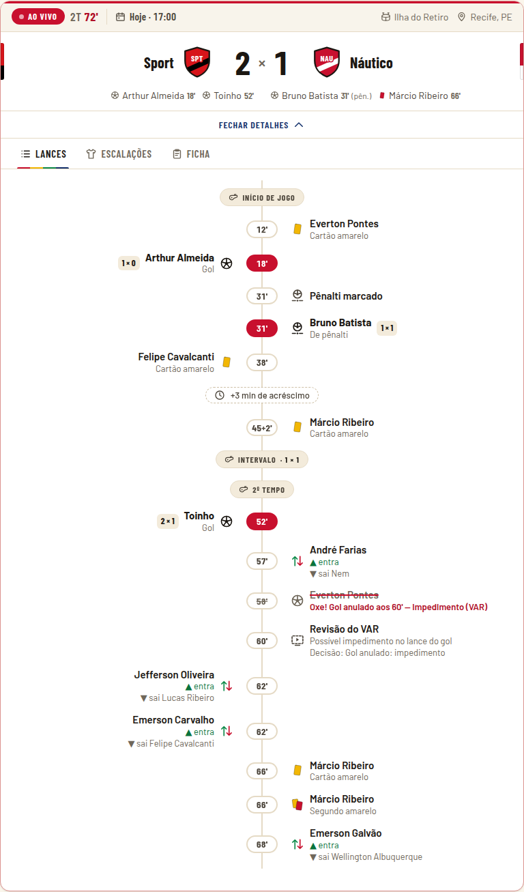
  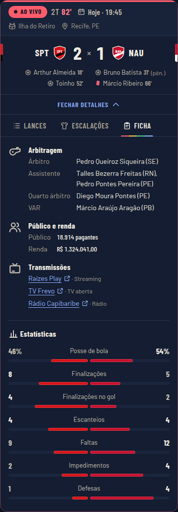
</p>

**Mata-mata**: confrontos com agregado, quem avança e a forma da decisão.

<p align="center">
  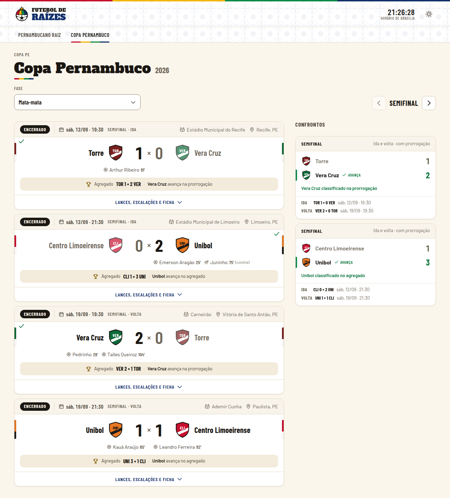
  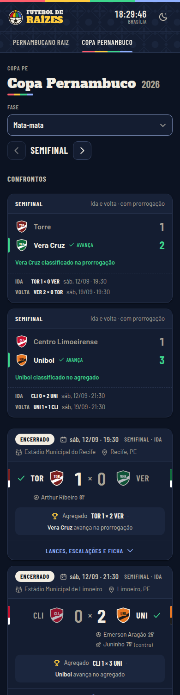
</p>

**Tela do operador**: lances primeiro, andamento do jogo à parte, status e linha do tempo
com cancelamento.

<p align="center">
  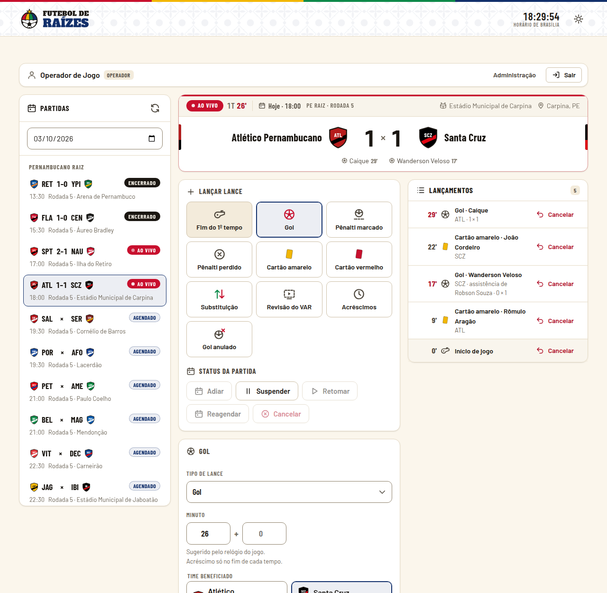
  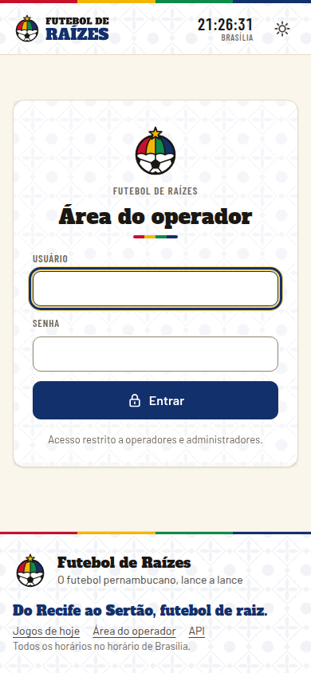
</p>

Outras: [home escura, 1280 px](docs/screenshots/home-escuro-1280.png) ·
[competição, 1280 px](docs/screenshots/competicao-claro-1280.png) ·
[competição escura, 390 px](docs/screenshots/competicao-escuro-390.png) ·
[operador escuro, 390 px](docs/screenshots/operador-escuro-390.png).
